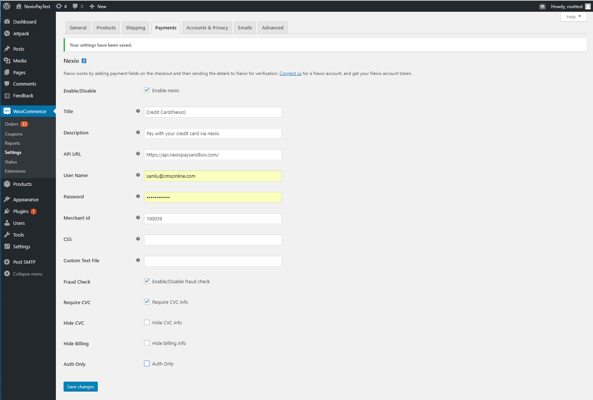
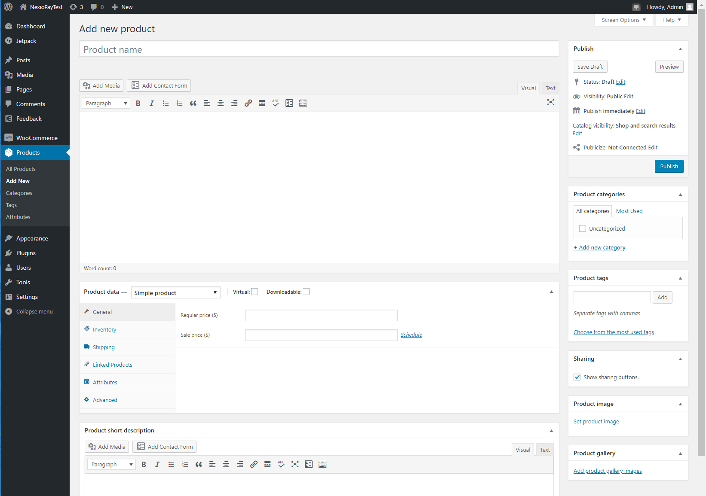
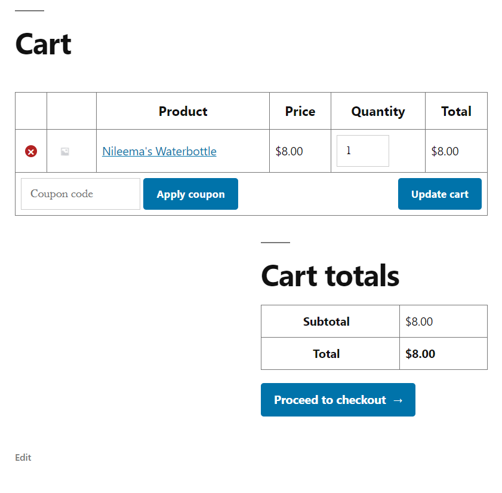
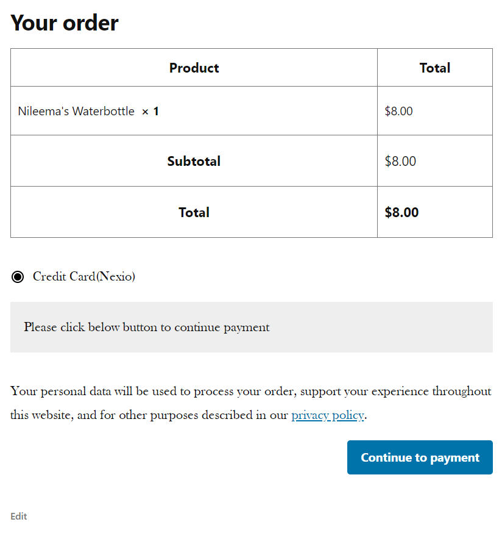
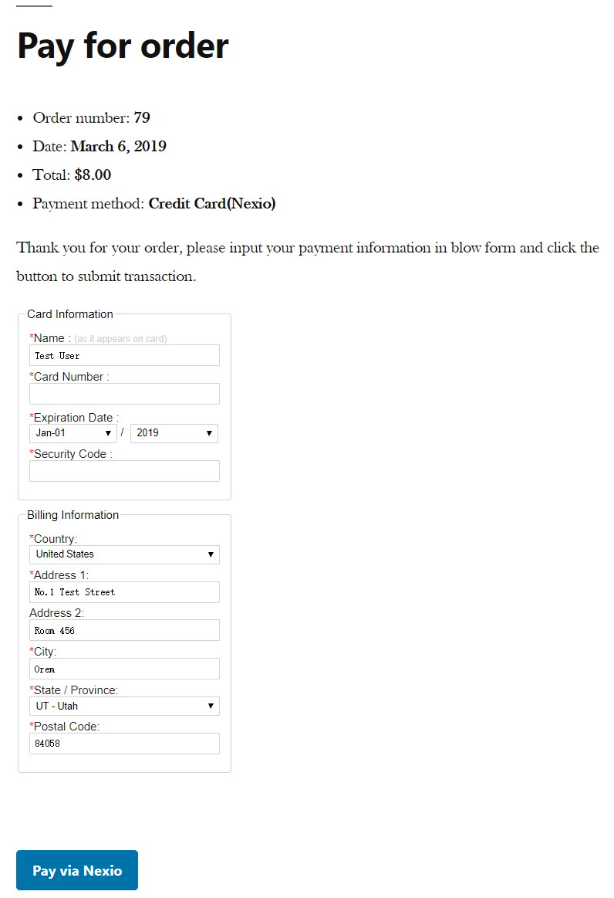

# cms-gateway-nexio
A Nexio WooCommerce plugin. Takes credit card payments directly on your Wordpress store using Nexio.

### Description

Accept Credit Card transaction with [Nexio's](https://nexiopay.com/) payment platform. 

## Installation:

1. Unzip the `cms-gateway-nexio.zip` file.
2. Copy the `cms-gateway-nexio` directory into your WordPress plugin directory: `wp-content/plugins`.
3. Log in to your WordPress Administration page.
4. Activate the plugin:
    a. On the left-hand menu, click on ‘Plugins’ then ‘Installed Plugins’.
    b. Find the ‘Nexio’ plugin.
    c. Click the ‘Activate’ link to activate the plugin.
Example:

5. Enable the payment method and set parameters:
    a. On the left-hand menu, click on ‘WooCommerce’.
    b. Under ‘WooCommerce’ click on ‘Settings’.
    c. Open the ‘Payments’ menu.
    d. Scroll down to the ‘Nexio’ method and activate it by clicking the toggle button.
    e. Scroll to the bottom and click ‘Save changes’.
Example:

6. Next, open the ‘Payments’ menu.
7. Select the ‘Enable Nexio’ check box.
8. Type in the following fields:
    - **Title**: Credit Card (Nexio)
    - **Description**: Your choice (See below for an example.)
    - **API URL**:
        - For testing: https://api.nexiopaysandbox.com/
        - For production: https://api.nexiopay.com/
    - **User Name**: Your Nexio username
    - **Password**: Your Nexio password
        _(If you have questions or if you need a Nexio username and password, please contact integrations@nexiopay.com)_
    - **Merchant Id**: The merchant id of your Nexio account
    - **Share Secret**: The share secret of merchant, it is used for signatrue verification
    - **CSS**: The URL where your CSS file is hosted (required for custom CSS).
    - **Custom Text File**: The URL where your custom text file is hosted.
    - **Fraud Check**: Enable fraud check through Kount.
        _(If you would like to enable Kount on your Nexio account, please contact integrations@nexiopay.com)_
    - **Require CVC**: Require CVC in Nexio form.
    - **Hide CVC**: Hide CVC.
    - **Hide Billing**: Hide billing info.
    - **Auth Only**: Make the transaction auth only.
    - **Signature Verify**: Enable or disable signature verification.
9. Scroll to the bottom of the page and click ‘Save changes’.
Example:

## Using the Plugin:
1. Create a product:
    a. Log in to your WordPress Administration page.
    b. On the left-hand menu, click on ‘Products’ then ‘Add New’.
    c. Type in your product details.
    d. Click ‘Publish’.
Example:

2. Add the product to cart:
    a. Go to your WooCommerce shop or product page and the add product to your cart.

3. Check out and choose Nexio as the payment method:
    a. Once on the Cart page, click on the ‘Proceed to checkout’ button.
    

    b. Fill your billing details information.
    c. Choose ‘Credit Card (Nexio)’ as your payment method.
    d. Click the ‘Continue to payment’ button to proceed to the final order page.
    Example:
    
    
4. Fill in card information and submit the transaction:
    a. Once the ‘Pay for order’ page has loaded you will see a Nexio payment form.
    b. Enter in the required fields.
    c. Click the ‘Pay via Nexio’ button to submit the transaction.
    d. If the transaction succeeds, you will see an ‘order received’ page, otherwise, it will return to checkout page for retry.
    Example:
    

## Notes
- Requires at least: 4.4
- Tested up to: 0.0.7
- Requires PHP: 5.6
- Stable tag: 0.0.7
- License: GPLv3

## Changelog
* 0.0.1 - 2019-02-26
* 0.0.5 - 2019-04-03
* 0.0.6 - 2019-04-04
* 0.0.7 - 2019-04-05
* 0.0.8 - 2019-04-17
* 0.0.9 - 2019-04-18
* 0.0.10 - 2019-04-23
* 0.0.11 - 2019-05-04
* 0.0.12 - 2019-05-08